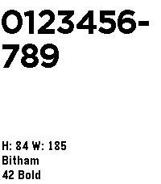

# app-font-browser

This example show how to load and display all the Pebble built-in system fonts. It was used for the screenshots in the official Pebble SDK documentation https://developer.rebble.io/guides/app-resources/system-fonts/

It also uses the [`Clicks`](https://developer.rebble.io/docs/c/group___clicks.html) API to allow the user to cycle through each font in both
directions.
